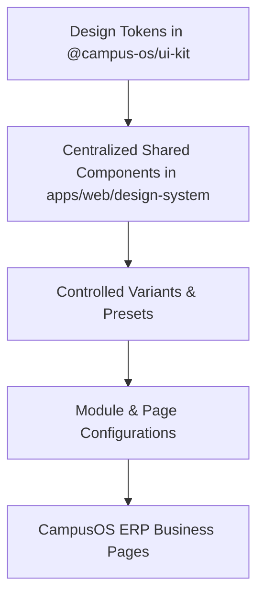

# CAMPUSOS CENTRALIZED DESIGN SYSTEM
## Architecture, Tokens, Component Registry & Permanent UI Standard

---

## 1. Executive Philosophy & The One-Query Principle

CampusOS operates under a strict centralized design architecture:

$$\text{ONE QUERY} \longrightarrow \text{ONE CENTRALIZED COMPONENT/TOKEN CHANGE} \longrightarrow \text{EVERY CONSUMING PAGE UPDATES AUTOMATICALLY}$$

### Overrides Hierarchy
1. **GLOBAL DEFAULT**: Applied automatically across all consuming ERP modules unless overridden.
2. **MODULE VARIANT**: Controlled variant applied across a specific ERP module (e.g., `AdminTable variant="hr"`).
3. **PAGE VARIANT**: Controlled variant applied to a specific sub-page (e.g., `AdminTable density="compact"`).
4. **EXPLICIT PAGE-SPECIFIC EXCEPTION**: Authorized one-off custom implementation for unique workflows.

> [!IMPORTANT]
> **Strict Anti-Duplication Rule**: Never copy-paste reusable UI components or create ad-hoc page-specific CSS classes. All visual variations must be achieved through centralized tokens, props, and controlled variants.

---

## 1.1 DATABASE PRESERVATION — LOCKED ENGINEERING RULE (PERMANENT)

> [!CAUTION]
> **PERMANENT SYSTEM-WIDE DATABASE INVARIANT (Applies to All Current and Future Modules)**:
> - **Existing Database Records Must NEVER be Reset**: Existing database data must NEVER be reset, reseeded, deleted, replaced, truncated, recreated, overwritten, or modified merely to implement or test a new page or feature.
> - **Approved Business Records Preserved**: Existing approved business records (Head Offices, Regions, Schools, Branches, Users, Roles, Memberships, Hierarchy Nodes) must remain exactly preserved with their existing UUIDs, relationships, and historical data.
> - **Non-Destructive Schema Evolution**: Schema changes must use only safe, additive, backward-compatible migrations (`ADD COLUMN IF NOT EXISTS`, nullable/defaulted columns). No destructive column/table drops or type alter cascades.
> - **No Auto-Reset on Restart**: Automatic seeding, resetting, or reinitializing on app/API restart is strictly prohibited. The system must reconnect to the existing persistent database.
> - **Isolated Disposable Test Records**: All testing must use isolated, disposable test records that do not mutate existing approved business data.
> - **Reporting Policy**: Any discovery of orphan/inconsistent data must be reported first rather than automatically altered or wiped.
> - **Stop and Report**: Before any potentially destructive DB operation, STOP and report instead of executing it.

---

## 2. Permanent UI Architecture Flow

---

## 3. Centralized Design Tokens Reference

All design tokens are defined in [`packages/ui-kit/src/tokens.ts`](file:///C:/Users/Adi/Desktop/CampusOS/packages/ui-kit/src/tokens.ts) and wired directly into the Tailwind preset.

### 3.1 Semantic Colors
- **Brand / Primary**: `primary[50..900]`, base: `#4f46e5` (Indigo 600), hover: `#4338ca`, active: `#3730a3`, text: `#ffffff`.
- **Secondary**: `secondary[50..600]`, base: `#f1f5f9` (Slate 100), hover: `#e2e8f0`.
- **Success / Valid**: `success[50..700]`, base: `#10b981` (Emerald 500), hover: `#059669`.
- **Danger / Delete**: `danger[50..700]`, base: `#e11d48` (Rose 600), hover: `#be123c`.
- **Warning**: `warning[50..700]`, base: `#f59e0b` (Amber 500), hover: `#d97706`.
- **Info / Action View**: `info[50..700]`, base: `#2563eb` (Blue 600), hover: `#1d4ed8`.
- **Neutral Scale**: `neutral[50..950]` (Slate scale).
- **Surfaces & Overlays**: `pageBackground` (`#f8fafc` / `#020617`), `surface` (`#ffffff` / `#0b0f19`), `overlay` (`rgba(15, 23, 42, 0.75)`), `focus` (`#6366f1`).

### 3.2 Typography & Scales
- **Font Family**: Inter, system-ui, sans-serif.
- **Sizes**: `xs` (12px), `sm` (14px), `base` (16px), `lg` (18px), `xl` (20px), `2xl` (24px), `3xl` (30px).
- **Weights**: normal (400), medium (500), semibold (600), bold (700).
- **Semantic Presets**: `pageTitle` (20px bold -0.02em), `sectionTitle` (16px semibold), `tableHeader` (12px bold 0.05em uppercase), `button` (13px semibold), `label` (12px semibold).

### 3.3 Spacing & Layout
- **Page Padding**: `1.5rem` (24px).
- **Section Gap**: `1.25rem` (20px).
- **Card Padding**: `1.25rem` (20px).
- **Form Grid Gap**: `1rem` (16px) horizontal, `0.375rem` (6px) field label gap.
- **Table Density Cell Padding**: `compact` (8px 12px), `normal` (14px 16px), `comfortable` (18px 20px).

### 3.4 Radius
- **Tokens**: `xs` (4px), `sm` (6px), `md` (8px), `lg` (12px), `xl` (16px), `pill` (9999px).
- **Semantic**: `button` (8px), `rowAction` (8px / rounded-lg), `card` (12px), `modal` (16px), `badge` (9999px / pill).

### 3.5 Control & Modal Dimensions
- **Action Button Height**: `2.25rem` (36px).
- **Row Action Button**: `1.75rem` (28px / `h-7 w-7`).
- **Input Height**: `2.375rem` (38px).
- **Modal Widths**: `sm` (448px), `md` (576px), `lg` (672px), `wide` (768px), `form` (1024-1100px / `5xl`), `details` (1024-1100px / `5xl`), `fullscreenSafe` (94vw).

### 3.6 Z-Index Layers
- `base`: 0
- `stickyContent`: 10
- `header`: 30
- `navigation`: 40
- `dropdown`: 50
- `popover`: 60
- `modalBackdrop`: 90
- `modal`: 100
- `nestedModal`: 120 (e.g. Connected Units opened on top of View Details)
- `nestedPopover`: 130
- `toast`: 150

---

## 4. Canonical Command Mapping

Future user instructions map directly to centralized components/tokens:

| User Command | Target Centralized Component / Token | File Location |
|---|---|---|
| **"Change Add Button"** | `PrimaryActionButton` | [`components/buttons/PrimaryActionButton.tsx`](file:///C:/Users/Adi/Desktop/CampusOS/apps/web/design-system/components/buttons/PrimaryActionButton.tsx) |
| **"Change Action Buttons"** | `RowActions` (`ViewAction`, `EditAction`, `DeleteAction`) | [`components/actions/RowActions.tsx`](file:///C:/Users/Adi/Desktop/CampusOS/apps/web/design-system/components/actions/RowActions.tsx) |
| **"Change Page Header"** | `AdminPageHeader` | [`components/headers/AdminPageHeader.tsx`](file:///C:/Users/Adi/Desktop/CampusOS/apps/web/design-system/components/headers/AdminPageHeader.tsx) |
| **"Change Tabs"** | `AdminModuleTabs` | [`components/tabs/AdminModuleTabs.tsx`](file:///C:/Users/Adi/Desktop/CampusOS/apps/web/design-system/components/tabs/AdminModuleTabs.tsx) |
| **"Change Table"** | `AdminTable` & `TableDensity` | [`components/tables/AdminTable.tsx`](file:///C:/Users/Adi/Desktop/CampusOS/apps/web/design-system/components/tables/AdminTable.tsx) |
| **"Change Form Layout"** | `AdminFormModal` / `FormGrid` | [`components/forms/FormLayout.tsx`](file:///C:/Users/Adi/Desktop/CampusOS/apps/web/design-system/components/forms/FormLayout.tsx) |
| **"Change View Popup"** | `AdminDetailsModal` | [`components/modals/AdminModal.tsx`](file:///C:/Users/Adi/Desktop/CampusOS/apps/web/design-system/components/modals/AdminModal.tsx) |
| **"Change Connected Units"** | `ConnectedCountPill` & `ConnectedUnitsModal` | [`components/relationships/ConnectedCountPill.tsx`](file:///C:/Users/Adi/Desktop/CampusOS/apps/web/design-system/components/relationships/ConnectedCountPill.tsx) |
| **"Change Status Badge"** | `StatusBadge` | [`components/badges/StatusBadge.tsx`](file:///C:/Users/Adi/Desktop/CampusOS/apps/web/design-system/components/badges/StatusBadge.tsx) |
| **"Change Modal Overlay"** | `designTokens.colors.overlay` / `AdminModal` | [`packages/ui-kit/src/tokens.ts`](file:///C:/Users/Adi/Desktop/CampusOS/packages/ui-kit/src/tokens.ts) |

---

## 5. Master 26-Category Component Registry

1. **Foundation / Global Theme**: `designTokens.colors`, `designTokens.typography`, `designTokens.spacing`, `designTokens.radius`.
2. **Application Layout**: `AppShell`, `DualTopHeader`, `WorkingContextPicker`.
3. **Page Header**: `AdminPageHeader`, `AdminBreadcrumb`, `FavoriteButton`, `QuickActionButton`.
4. **Tabs & Navigation**: `AdminModuleTabs`, `AdminSubTabs`, `SectionNavigation`.
5. **Cards & Summary**: `MetricCard`, `SummaryCard`, `IdentityCard`.
6. **Tables**: `AdminTable`, `AdminTableHead`, `AdminTableBody`, `AdminTableRow`, `AdminTableTd`, `AdminPagination`.
7. **Row Actions**: `RowActions` (View `#2563eb`, Edit `#059669`, Delete `#e11d48`).
8. **Connected Units / Relationships**: `ConnectedCountPill` (`🔗 <count>`), `ConnectedUnitsModal`.
9. **Search / Filters / Pagination**: `AdminSearch`, `FilterSelect`, `FilterChip`, `DateFilter`, `StatusFilter`.
10. **Buttons**: `PrimaryActionButton`, `Button`, `ButtonGroup`, `IconButton`.
11. **Forms — Structure**: `AdminFormModal`, `FormContainer`, `FormSection`, `FormGrid`, `FormField`.
12. **Form Controls**: `TextInput`, `SelectField`, `NumberInput`, `PasswordField`, `PhoneInput`, `EmailInput`, `TextArea`, `Checkbox`, `ToggleSwitch`.
13. **Files / Images**: `LogoUpload`, `EntityLogo`, `LogoPlaceholder` (🏫, 🏢, 🌐), `Avatar`.
14. **Modals / Popups / Overlays**: `AdminModal`, `ConfirmModal`, `DeleteConfirmModal`, `ModalOverlay`.
15. **View Details**: `DetailsHeader`, `DetailsSection`, `DetailsGrid`, `DetailsField`, `SocialLink` (`wa.me`), `LinkedAccountCard`.
16. **Status / Badges / Tags**: `StatusBadge` (`Active`, `Inactive`, `Pending`, `Approved`, `Rejected`, `Draft`, `Archived`).
17. **Feedback / Messages**: `Toast`, `Alert`, `ValidationMessage`.
18. **Loading / Empty / Error States**: `EmptyState`, `NoResultsState`, `LoadingState`, `Skeleton`, `Spinner`.
19. **Hierarchy**: `HierarchyScopePicker`, `TreeView`, `TreeNode`, `HierarchyPath`.
20. **Notifications**: `NotificationCenter`, `NotificationItem`, `NotificationBadge` *(Planned)*.
21. **Audit / History**: `AuditSummary`, `ActivityTimeline`, `ChangeDiff`.
22. **Workflow / Progress**: `StepProgress`, `WorkflowStepper`, `ApprovalActions` *(Planned)*.
23. **Calendar / Scheduling**: `CalendarView`, `ScheduleCard`, `TimeSlot` *(Planned)*.
24. **Dashboard / Reporting**: `ChartCard`, `TrendIndicator`, `ReportTable` *(Planned)*.
25. **Help / Utility**: `HelpTooltip`, `InfoHint`, `CopyButton`, `ShortcutHint` *(Planned)*.
26. **Advanced / Future Components**: `DynamicFormBuilder`, `FormRuntimeRenderer`, `RichTextEditor`.

---

## 6. Administration Design System Page

- **Location**: `Administration Configuration -> CampusOS Design System`
- **Route**: [`/admin-config/ui-system`](file:///C:/Users/Adi/Desktop/CampusOS/apps/web/app/%28admin%29/admin-config/ui-system/page.tsx)
- **Top Header Structure**: Both existing ERP top-header navigation layers are strictly preserved.
- **IAM Permission Protection**: Secured with `DESIGN_SYSTEM_VIEW` capability. Unauthenticated or non-admin sessions fail closed with a clear access restriction card.
- **Live Previews**: Clicking "View Live Preview" mounts the actual shared component with interactive variant switchers, state toggles, and token inspectors.

---

## 7. Permanent Rules for Future Development & Migration

### LOCKED POLICY: CAMPUSOS DESIGN SYSTEM FIRST POLICY
> [!IMPORTANT]
> **PERMANENT LOCKED ENGINEERING RULE**:
> Every CampusOS page, module, form, table, modal, button, card, status, navigation element, input, selector, feedback state, relationship UI, hierarchy UI and other reusable UI pattern **MUST first use the applicable CampusOS Design System standard**.
>
> Architecture:
> `Design Tokens -> Canonical Shared Components -> Controlled Variants -> Module/Page Configuration -> CampusOS Business Pages`
>
> **NEVER**:
> `Business Page -> Local CSS -> Local Duplicate Component`

### STAT CARD DEFAULT CONTRACT
- **Canonical Component**: `StatCard` (`apps/web/design-system/components/cards/StatCard.tsx`)
- **Default Visual Structure**:
  - **Top Row**: Left: Label / Title (`text-xs font-semibold text-slate-500 uppercase tracking-wider`). Right: Professional Icon container with rounded tint (`p-2 rounded-xl bg-... border border-...`).
  - **Bottom Row**: Left: Large metric value (`text-2xl font-black text-slate-900 dark:text-white tracking-tight`). Right: Optional trend / context (`text-xs font-semibold text-slate-400`).
- **Variants Supported**: `default`, `primary`, `success`, `warning`, `info`.
- **Icon Standard**: Professional Lucide icons with dimensions (e.g. `<Building2 className="w-5 h-5" />`, `<School className="w-5 h-5" />`, `<GraduationCap className="w-5 h-5" />`, `<Globe className="w-5 h-5" />`, `<Calendar className="w-5 h-5" />`) instead of raw emoji characters.
- **Context Integrity**: If no real context or subtitle exists, do not invent one and do not show placeholder text.

### ROW ACTIONS DEFAULT CONTRACT
- **Canonical Component**: `RowActions` with composable sub-actions (`apps/web/design-system/components/actions/RowActions.tsx`)
- **Action Sub-components & Standards**:
  - `ViewAction`: Blue (`#2563eb` / `Eye` icon)
  - `EditAction`: Emerald (`#059669` / `Edit2` icon)
  - `DeleteAction`: Rose (`#e11d48` / `Trash2` icon)
  - `StatusAction`: Status toggle action button (`Activate` / `Suspend`)
  - `MoreActionsMenu`: Neutral (`#475569` / `MoreHorizontal` icon)
- **Canonical Action Order**: `View -> Edit -> Status/Contextual Action -> Delete -> More Actions`
- **Business Capability Invariant**: Only render actions supported by the specific page and authorized by the current user's permissions. Do not force unsupported actions.

### Rule for New Pages
Before creating any visual layout:
1. Inspect the **CampusOS Design System** catalog (`/admin-config/ui-system`) and canonical exports from `apps/web/design-system`.
2. Import canonical components:
   - Summary/KPI Cards: `<StatCard title="..." value={...} icon={<Icon className="w-5 h-5" />} subtitle="..." variant="..." />`
   - Status: `<StatusBadge status={...} />`
   - Table Row Actions: `<RowActions><ViewAction onClick={...} /><EditAction onClick={...} /><DeleteAction onClick={...} /></RowActions>`
   - Connected Units: `<ConnectedCountPill count={...} onClick={...} />`
   - Selection Controls: `<MultiSelect />`, `<HierarchyMultiSelect />`
3. If a variant is required, add a controlled variant to the shared design system component rather than writing local duplicate JSX or ad-hoc CSS.

### Rule for Page Migration
- **Zero Business Logic Regressions**: Database schema, API contracts, validations, permissions, working context, and audit trails must remain 100% untouched during visual migration.
- Reusable presentation patterns migrate to their canonical Design System equivalents. Real labels, values, counts, calculations, icons, links, and permissions are preserved exactly.
