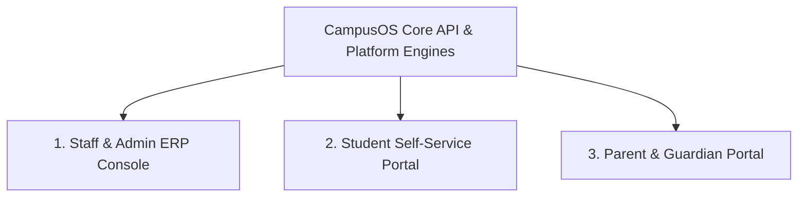

# 00. CampusOS Product Vision & Strategic Architecture

---

## 1. Executive Summary

**CampusOS** is an enterprise-grade, configurable, multi-organization Enterprise Resource Planning (ERP) platform. It is engineered from the ground up on a foundational philosophy:

> **"Configure, Don't Customize."**

Traditional educational management systems are rigid, hardcoded monoliths built around a single assumed institutional model (e.g., *School -> Class -> Section -> Student*). When an institution requires a different structure (e.g., multi-campus collegiate systems, vocational institutes, research universities, regional educational directorates, or corporate academies), traditional systems require expensive, slow, and error-prone source code customizations.

**CampusOS eliminates code customization.** It provides a domain-agnostic platform foundation equipped with first-class visual builder engines, enabling organizations to configure their entire operational universe—hierarchies, data entities, forms, workflows, approval chains, accounting rules, dashboards, and role permissions—without developers modifying a single line of backend or frontend source code.

---

## 2. Platform Architecture & Layering

CampusOS operates across three distinct security and operational tiers:

```
┌────────────────────────────────────────────────────────────────────────────────────────┐
│                        1. PLATFORM OWNER ADMINISTRATION LAYER                          │
│   Tenant Provisioning • Global Subscriptions • Platform Catalog • Global Audit Log     │
├────────────────────────────────────────────────────────────────────────────────────────┤
│                        2. CUSTOMER TENANT RUNTIME & BUILDERS                           │
│   Multi-Tenant Portal  •  Dynamic Form Renderer  •  Workflow FSM  •  Dashboard Grid    │
│   Hierarchy Builder • Entity Builder • Form Builder • Workflow Builder • Report Builder│
├────────────────────────────────────────────────────────────────────────────────────────┤
│                        3. STABLE PLATFORM CORE & DATA ACCESS                           │
│   Multi-Tenancy • IAM & ABAC • Data Scopes • Double-Entry Ledger • Audit Trail • Events│
└────────────────────────────────────────────────────────────────────────────────────────┘
```

1. **The Platform Owner Administration Layer**: A security-separated administrative tier above customer organizations. Platform admins provision organizations, hierarchy nodes, and initial administrators via privileged service paths with dedicated audit trails. It is never an unrestricted bypass for normal tenant data queries.
2. **The Builder Suite**: A visual, drag-and-drop administrative environment where organization administrators and platform architects configure metadata definitions.
3. **The Dynamic Runtime Engine**: A high-performance execution engine that reads published metadata definitions and renders dynamic UI forms, evaluates conditional logic, orchestrates state transitions, enforces granular data scopes, and records double-entry accounting transactions.
4. **The Stable Platform Core**: The immutable, highly optimized system infrastructure providing tenant isolation, cryptographic identity, database-level row security, change data capture, and asynchronous job distribution.

---

## 3. Domain-Agnostic Core Primitives

The core engines of CampusOS have **zero hardcoded dependencies on educational terminology**. The platform core is constructed from universal enterprise primitives:

| Platform Core Primitive | Description | Educational Domain Mapping (Example) |
|---|---|---|
| `Party` | An individual person or legal entity | Student, Faculty, Parent, Vendor, Alumni, Staff |
| `Node` | A unit in a configurable hierarchy tree | Organization, Head Office, Region, Campus, Faculty, Dept |
| `Entity` | A structured business data model | Course, Enrollment, Hostel Room, Transport Route, Asset |
| `Record` | A concrete instance of an entity | "Physics 101", "Room 304 - North Wing" |
| `FormVersion` | A versioned layout & validation schema | Admission Application Form 2026, Scholarship Request Form |
| `WorkflowInstance` | A stateful lifecycle with approval gates | Admission Pipeline, Leave Request, Purchase Order |
| `Account` / `Posting` | Double-entry financial accounts & journals | Tuition Revenue, Student Receivable, Cash at Bank |
| `Policy` | A rule binding Role, Action, & Data Scope | "Campus Accountants can read invoices in their Campus Node" |

By keeping core primitives domain-agnostic, CampusOS can power school networks today and seamlessly expand to universities, vocational polytechnics, hospitals, and corporate training networks tomorrow.

---

## 4. Variable-Depth Hierarchy Model

CampusOS natively supports organizations from single-location schools to global educational networks without requiring fake hierarchy nodes:

- **Case A**: Platform → Organization → Head Office → Region → School → Branch
- **Case B**: Platform → Organization → Head Office → School → Branch
- **Case C**: Platform → Organization → School → Branch
- **Case D**: Platform → Organization → School (single-location: School is the operational node)

Head Office is optional. Region is optional. Branch is optional. The School itself can serve as the operational node.

---

## 5. Education as the First Domain Application

While the platform core is universal, **Education & School/University Management is the flagship first domain implementation**.

The Education Domain is packaged as a suite of modular domain extensions built strictly on top of the platform engines:
* **Academic Lifecycle Management**: Configurable terms, programs, courses, prerequisites, and grading schemes.
* **Student Information System (SIS)**: Holistic student profile records, guardian relationships, and dynamic custom attributes.
* **Admissions & Enrollment**: Multi-stage online admission portals with dynamic application forms, automated document verification workflows, and entrance score calculations.
* **Fee Billing & Financial Collection**: Configurable fee structures, discount rules, automated invoice generation, challan printing, and online payment reconciliation posting into the general ledger.
* **Faculty & Staff HR**: Staff records, workload assignments, leave workflows, and payroll integration.

---

## 6. Three Distinct Application Experiences

CampusOS provides three tailored client experiences, sharing the same underlying APIs, permission model, and dynamic engines:



1. **Staff & Admin ERP Console**: High-density, keyboard-friendly, desktop-first workspace for administrators, registrars, accountants, teachers, and directors. Houses all 8 visual builder engines and advanced data tables.
2. **Student Portal**: Modern, responsive, mobile-friendly interface for course registrations, timetable viewing, assignment submissions, fee payments, and grade cards.
3. **Parent Portal**: Clean, accessible portal for monitoring multi-child attendance, fee dues, academic progress, and institutional communications.

---

## 7. What CampusOS IS vs. What CampusOS IS NOT

| What CampusOS IS | What CampusOS IS NOT |
|---|---|
| **A Configurable Platform**: Institutions define their own fields, forms, approval hierarchies, and menus. | **A Hardcoded School Script**: Never a static template with fixed database tables for arbitrary forms. |
| **Multi-Organization by Design**: Natively handles multi-tenant networks with distinct branding, structures, and fiscal rules. | **A Single-Tenant Monolith**: Never assumes one institution per deployment. |
| **Strictly Governed & Audited**: Dual-layer security (Application ABAC + PostgreSQL RLS) with immutable audit logs. | **An Uncontrolled "No-Code" Sandbox**: Never sacrifices data integrity, ACID accounting, or schema typing for flexibility. |
| **A Hybrid Relational Architecture**: High-speed relational tables for core financial and identity data, combined with indexed JSONB for dynamic extensions. | **A Pure NoSQL / Generic EAV Dump**: Never stores everything in un-indexed JSON. |

---

## 8. Strategic Non-Negotiable Directive

> **Architectural Law**: CampusOS must never gradually degrade into a collection of hardcoded school screens. Any new feature must be evaluated against platform capabilities: if a requirement can be solved by extending a builder engine or configuring metadata, it **must** be implemented via configuration, not by adding custom tables or one-off screens.
