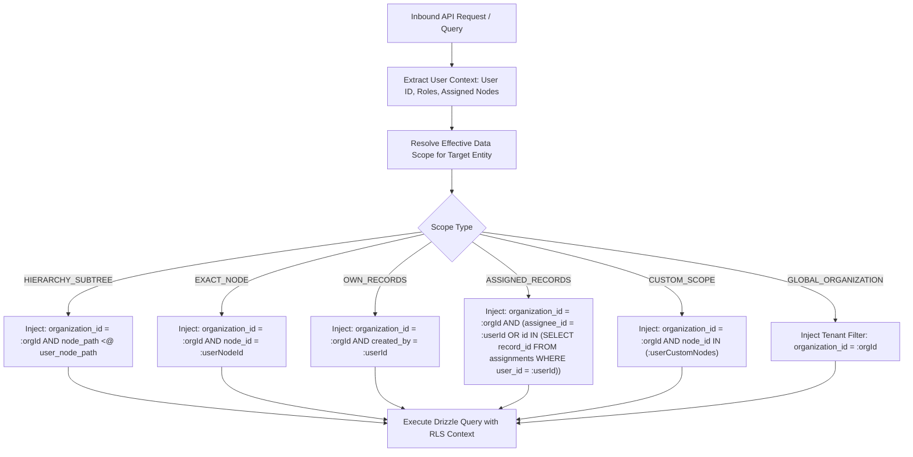

# 04. Data Scopes & Hierarchical Visibility Engine

---

## 1. Core Principle: Server-Side Data Scope Enforcement

Role permissions dictate **WHAT** actions a user can perform (e.g. `READ student`). 
**Data Scopes dictate WHICH records** in the organization a user is allowed to see or touch.

> **Absolute Rule**: Data scopes are **always enforced on the backend at query-compilation time**. The client UI never receives out-of-scope records and filters them locally.

---

## 2. The 6 Standard Data Scope Types

CampusOS supports 6 standard data scope definitions:

| Scope Type | Scope Label | Data Boundary & Filter Predicate | Example Use Case |
|---|---|---|---|
| `GLOBAL_ORGANIZATION` | Entire Organization | No node filter applied. The user sees all records across all campuses, regions, and branches. | Head Office CEO, Group CFO, Central Internal Auditor |
| `HIERARCHY_SUBTREE` | Assigned Node & Descendants | `record.node_id IN (SELECT id FROM hierarchy_nodes WHERE path <@ user_node.path)` | Regional Director (sees region + all campuses + all departments in region) |
| `EXACT_NODE` | Exact Assigned Node Only | `record.node_id = user_assigned_node.id` | Campus Accountant (sees transactions strictly in their campus node) |
| `OWN_RECORDS` | Self-Created Records Only | `record.created_by = current_user.id` | Student viewing their own applications, Staff viewing own leave requests |
| `ASSIGNED_RECORDS` | Explicitly Assigned Records | `record.assignee_id = current_user.id OR user_id = current_user.id` | Faculty Member viewing assigned student advisees or assigned course sections |
| `CUSTOM_SCOPE` | Multi-Node Explicit Grant | `record.node_id IN (user_custom_node_list)` | Visiting Professor teaching across Campus A and Campus B |

---

## 3. Data Scope Evaluation Pipeline

---

## 4. Scope Interactions Across Subsystems

### 1. Visual Report Builder
When a user builds or executes a custom report, the Report SQL Compiler automatically injects the user's active node path constraint into the report's `WHERE` clause. A Regional Manager running an *Enrollment Report* will only receive aggregated numbers for their region and its child campuses.

### 2. Dynamic Dashboards
Dashboard KPI cards and chart aggregations (e.g., *"Total Fees Collected This Month"*) execute aggregate SQL queries wrapped in the user's data scope filter. The Head Office sees group-wide totals; the Campus Director sees campus-wide totals; the Department Head sees departmental totals.

### 3. CSV / Excel Exports
Export streaming pipelines inherit the identical data scope security predicates as the UI data grid. Users can never export records outside their authorized scope.

### 4. Background Workers & BullMQ Jobs
When a user triggers an asynchronous batch job (e.g., *"Generate Semester Invoices"*), the job payload captures `{ tenantId, userId, scopeNodePath }`. The background worker processes invoices strictly within the captured hierarchy scope.

### 5. Double-Entry Accounting
Every journal entry line captures an optional `node_id`. Campus-level accountants are scoped to create, view, and reconcile journals belonging strictly to their campus node, while Central Treasury retains `GLOBAL_ORGANIZATION` visibility across all balance sheets.

---

## 5. Security Invariant

> **Rule**: If a query omits a data scope predicate due to developer error, the query will fail at the API Guard layer, and the underlying PostgreSQL RLS policy will enforce tenant-level isolation as a hard fallback.
