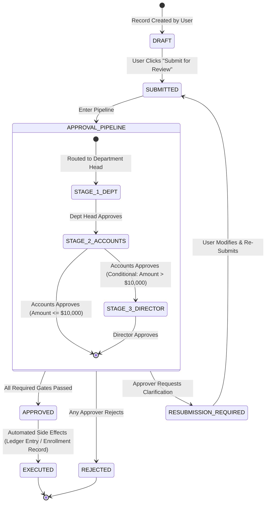

# 06. Dynamic Workflow Builder & Finite State Machine Engine

---

## 1. Overview & Core Philosophy

Workflows govern the lifecycle of business records: Admission Applications, Leave Requests, Fee Concession Approvals, Purchase Requisitions, and Grade Finalizations.

CampusOS provides a **Dynamic Workflow Builder & Finite State Machine (FSM) Runtime**:
* **Visual Graph Designer**: Node-and-edge visual canvas where administrators define states, transitions, conditional gates, approval roles, and automated actions.
* **Immutable Workflow Versioning**: Published workflows are versioned ($V_1, V_2, \dots$). Running instances remain permanently bound to the version under which they were created.

---

## 2. Finite State Machine (FSM) Lifecycle Blueprint



---

## 3. Workflow Versioning & Instance Integrity Rules

> **Cardinal Rule**: Never modify a workflow definition underneath an active, in-flight workflow instance.

```
┌─────────────────────────────────────────────────────────────────────────────┐
│ WORKFLOW DEFINITION (e.g., "Student Admission Pipeline")                   │
│                                                                             │
│  Version 1 (PUBLISHED - Jan 2026): [Draft -> HOD -> Enrolled]               │
│  Version 2 (PUBLISHED - Jun 2026): [Draft -> HOD -> Dean -> Enrolled]       │
│  Version 3 (DRAFT - In Progress) : [Draft -> Automated AI -> Enrolled]      │
├─────────────────────────────────────────────────────────────────────────────┤
│ RUNNING INSTANCES                                                           │
│  • Application #101 (Created Feb 2026) --> Bound to Version 1 (Executes V1) │
│  • Application #205 (Created Jul 2026) --> Bound to Version 2 (Executes V2) │
└─────────────────────────────────────────────────────────────────────────────┘
```

1. **Draft vs. Published**: Edits occur strictly on a `DRAFT` version. The existing `PUBLISHED` version continues serving active and new workflows until the draft is explicitly published.
2. **Instance Binding**: When a user creates a record, the newly instantiated workflow instance stores an immutable foreign key `workflow_version_id`.
3. **Rollback**: If Version 2 proves problematic, an administrator can mark Version 1 as `ACTIVE_PUBLISHED`. All subsequent submissions use Version 1, while existing Version 2 instances continue to follow their valid V2 transition rules until completion.

---

## 4. Advanced Transition Conditions & Gate Types

| Gate Type | Configuration Parameters | Operational Rule |
|---|---|---|
| **Role-Based Gate** | `target_role_id`, `data_scope` | Any user holding the specified role within the record's hierarchy node can approve. |
| **User-Based Gate** | `target_user_id` | A specific named individual must approve (e.g., Assigned Academic Advisor). |
| **Amount / Field Threshold** | `IF record.amount > 50000` | Condition evaluated via AST rule engine. If false, the gate is automatically bypassed. |
| **Parallel Multi-Approval** | `mode = ALL` or `mode = ANY` | Requires $N$ approvers in parallel before advancing to the next state. |
| **SLA & Escalation Timer** | `timeout_hours = 48` | If the gate is not acted upon within 48 hours, auto-escalate to the next hierarchy tier or send urgent reminders. |

---

## 5. Automated Side-Effect Actions

Upon reaching a designated state (e.g., `APPROVED`), the workflow engine can trigger automated actions:
1. **Double-Entry Accounting Posting**: Auto-generate a balanced journal voucher in the General Ledger.
2. **Entity Generation**: Automatically convert an `admission_application` record into an active `student` record.
3. **Notification Dispatch**: Send personalized email/SMS/in-app notifications via the Notification Engine.
4. **Outbound Webhooks**: Dispatch HMAC-signed JSON payloads to external campus security or library turnstiles.

---

## 6. Database Schema Specification

```sql
-- 1. Workflow Master Definitions
CREATE TABLE workflow_definitions (
    id UUID PRIMARY KEY DEFAULT gen_random_uuid(),
    organization_id UUID NOT NULL REFERENCES organizations(id) ON DELETE CASCADE,
    entity_id UUID NOT NULL REFERENCES entity_definitions(id) ON DELETE CASCADE,
    code VARCHAR(64) NOT NULL,
    name VARCHAR(128) NOT NULL,
    current_version INT DEFAULT 1,
    created_at TIMESTAMPTZ DEFAULT NOW(),
    UNIQUE(organization_id, code)
);

-- 2. Immutable Workflow Versions
CREATE TABLE workflow_versions (
    id UUID PRIMARY KEY DEFAULT gen_random_uuid(),
    workflow_definition_id UUID NOT NULL REFERENCES workflow_definitions(id) ON DELETE CASCADE,
    version INT NOT NULL,
    status VARCHAR(32) NOT NULL,        -- 'DRAFT', 'PUBLISHED', 'DEPRECATED'
    nodes_graph JSONB NOT NULL,         -- Visual canvas coordinates & states
    transitions JSONB NOT NULL,         -- Edges, conditions, approval gates, actions
    published_at TIMESTAMPTZ,
    published_by UUID,
    created_at TIMESTAMPTZ DEFAULT NOW(),
    UNIQUE(workflow_definition_id, version)
);

-- 3. Workflow Runtime Instances
CREATE TABLE workflow_instances (
    id UUID PRIMARY KEY DEFAULT gen_random_uuid(),
    organization_id UUID NOT NULL REFERENCES organizations(id) ON DELETE CASCADE,
    workflow_version_id UUID NOT NULL REFERENCES workflow_versions(id) ON DELETE RESTRICT,
    record_id UUID NOT NULL,            -- Linked target entity record
    current_state VARCHAR(64) NOT NULL,
    is_completed BOOLEAN DEFAULT FALSE,
    started_at TIMESTAMPTZ DEFAULT NOW(),
    completed_at TIMESTAMPTZ
);

-- 4. Workflow Transition History & Audit
CREATE TABLE workflow_logs (
    id UUID PRIMARY KEY DEFAULT gen_random_uuid(),
    workflow_instance_id UUID NOT NULL REFERENCES workflow_instances(id) ON DELETE CASCADE,
    from_state VARCHAR(64) NOT NULL,
    to_state VARCHAR(64) NOT NULL,
    action VARCHAR(32) NOT NULL,        -- 'APPROVE', 'REJECT', 'ESCALATE'
    actor_id UUID NOT NULL,
    comments TEXT,
    created_at TIMESTAMPTZ DEFAULT NOW()
);
```
