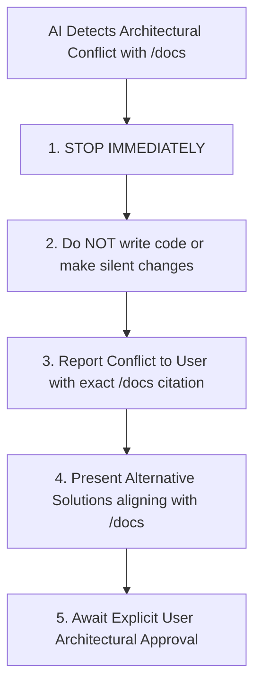

# 11. AI Agent & Developer Governance Rules

---

## 1. Absolute Authority of `/docs`

This document governs all future AI coding assistants and human developers working on CampusOS.

> **RULE ZERO**: The specifications in `/docs` constitute the **FINAL, AUTHORITATIVE ARCHITECTURAL SOURCE OF TRUTH**. An AI agent must never guess, assume, or improvise architecture when an explicit rule exists in `/docs`.

---

## 2. Mandatory Pre-Implementation Checklist

Before generating or modifying any code for a feature, the developer or AI agent **MUST evaluate and answer this 12-Point Checklist**:

```
┌─────────────────────────────────────────────────────────────────────────────┐
│                   MANDATORY PRE-IMPLEMENTATION CHECKLIST                    │
│                                                                             │
│  1. Ownership        : Which domain module or core engine owns this feature?│
│  2. Reuse            : Which existing platform engine must be reused?       │
│  3. Configuration    : Can this requirement be solved via metadata/config   │
│                        rather than writing new hardcoded code?              │
│  4. Permissions      : What action permissions apply? (READ/CREATE/APPROVE) │
│  5. Data Scope       : What hierarchy data scope applies? (SUBTREE/NODE/OWN)│
│  6. Multi-Tenancy    : Is tenant isolation enforced via RLS & TenantManager?│
│  7. Audit Logging    : Does this state mutation produce a CDC audit entry?  │
│  8. Versioning       : Does this mutate form/workflow/entity metadata, and  │
│                        does it require a new immutable version?             │
│  9. Event Bus        : Does this emit domain events to the Outbox table?    │
│ 10. Accounting Check : Does this affect financial balances, and does it     │
│                        comply with double-entry balance invariants?         │
│ 11. Background Task  : Should this long-running task be offloaded to BullMQ?│
│ 12. Documentation    : Does this change require updating /docs & CHANGELOG? │
└─────────────────────────────────────────────────────────────────────────────┘
```

---

## 3. Strict Prohibitions & Architectural Laws

1. **NEVER Hardcode Organization-Specific Logic**: Never write `if (tenantId === 'xyz')` or create one-off hardcoded tables for school-specific quirks. Always use the Dynamic Entity, Form, or Workflow engines.
2. **NEVER Bypass Database RLS**: Never execute raw database queries that skip setting `SET LOCAL app.current_tenant_id`. Always execute through `TenantTransactionManager`.
3. **NEVER Directly Mutate Posted Accounting Entries**: Never write `UPDATE journal_entries` or `DELETE FROM journal_lines` for posted records. Always generate offsetting Reversal Entries.
4. **NEVER Mutate Published Metadata in Place**: Never update an active `form_versions` or `workflow_versions` row. Always create a new draft or publish version $N+1$.
5. **NEVER Bypass Backend Authorization**: Never rely exclusively on frontend UI hiding for security. Always enforce role permissions and hierarchy scopes at the controller/service layer.
6. **NEVER Place High-Volume Relational Ledgers into Unindexed JSONB**: Strictly follow the Three-Tier Storage Strategy defined in `08_DATABASE_ARCHITECTURE.md`.
7. **NEVER Sacrifice Configurability for Implementation Speed**: A quick hack today is technical debt tomorrow. If a requirement calls for dynamic forms or workflows, use the platform engine.

---

## 4. Conflict Resolution Protocol

If a user prompt, requirement, or external library recommendation conflicts with the approved specifications in `/docs`:



---

## 5. Documentation Maintenance Protocol

* Whenever an approved architectural amendment is agreed upon with the user, the relevant `/docs` file **must be updated first** before modifying application code.
* Every architectural update must be recorded in `/docs/CHANGELOG.md`.
