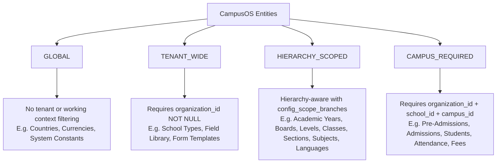

# CampusOS — Master Organizational Ownership & Working Context Architecture

## Permanent Non-Negotiable Platform Standard

### 1. The Three Core Separation Invariants

CampusOS strictly separates these three fundamental platform concepts:

```
┌────────────────────────────────────────────────────────────────────────┐
│ 1. RECORD OWNERSHIP ("Whose data is this?")                            │
│    Durable database persistence: organization_id, school_id, campus_id.│
├────────────────────────────────────────────────────────────────────────┤
│ 2. WORKING CONTEXT ("Which organizational unit am I working in?")      │
│    Active tenant/hierarchy boundary for UI sessions and queries.       │
├────────────────────────────────────────────────────────────────────────┤
│ 3. USER AUTHORIZATION ("Which organizational nodes can I access?")     │
│    RBAC & Data scope permissions (Head Office, Region, School, Campus).│
└────────────────────────────────────────────────────────────────────────┘
```

> [!IMPORTANT]
> **Working Context NEVER replaces durable database ownership.**
> Working Context is an operational filter and write-default that can **narrow** user authorization; it can **never expand** user authorization.

---

### 2. The Four Permanent Scope Modes

Every current and future database entity, page, and API endpoint MUST declare its `ScopeMode` in `CAMPUS_OS_SCOPE_MATRIX`:



| Scope Mode | Mandatory Columns | Scoping Mechanism | Example Entities |
| :--- | :--- | :--- | :--- |
| **`GLOBAL`** | None | Not filtered by tenant or context | Countries, States, Cities, Global Constants |
| **`TENANT_WIDE`** | `organization_id NOT NULL` | Filtered strictly by active tenant | School Types, Field Library, Form Templates |
| **`HIERARCHY_SCOPED`** | `organization_id`, `owner_type`, `owner_id`, `apply_to` + `config_scope_branches` | Effective scope intersection (`userAuthorizedScope ∩ workingContextScope`) | Academic Years, Boards, Levels, Classes, Sections, Subjects, Languages |
| **`CAMPUS_REQUIRED`** | `organization_id NOT NULL`, `school_id NOT NULL`, `campus_id NOT NULL` | Exact campus matching or authorized descendant rollup | Pre-Admissions, Test Schedules, Candidates, Student Enrollments, Attendance |

---

### 3. Drizzle Schema Ownership Guardrails

To prevent developers from accidentally creating un-anchored or un-isolated database tables, CampusOS provides base table builders in `packages/database`:

```typescript
import {
  tenantScopedTable,
  campusScopedTable,
  hierarchyScopedConfigTable,
} from '@campus-os/database';

// 1. For TENANT_WIDE tables (enforces organization_id):
export const myTenantMaster = tenantScopedTable('my_tenant_master', {
  name: varchar('name', { length: 255 }).notNull(),
});

// 2. For CAMPUS_REQUIRED operational tables (enforces organization_id + school_id + campus_id):
export const myOperationalTable = campusScopedTable('my_operational_table', {
  transactionCode: varchar('transaction_code', { length: 64 }).notNull(),
});

// 3. For HIERARCHY_SCOPED configuration masters:
export const myHierarchyMaster = hierarchyScopedConfigTable('my_hierarchy_master', {
  name: varchar('name', { length: 255 }).notNull(),
});
```

---

### 4. Working Context Golden Rule

```
EffectiveScope = UserAuthorizedScope ∩ SelectedWorkingContextScope
```

1. **Selected CAMPUS** (e.g. DHA Phase 6 Campus):
   - Returns ONLY records belonging to DHA Phase 6 Campus.
2. **Selected SCHOOL** (e.g. Beacon Horizon Public School):
   - Returns records belonging to the school and all its authorized child campuses (Main, Clifton, DHA).
3. **Selected REGION** (e.g. South Region):
   - Returns records belonging to all authorized schools and campuses in that region.
4. **Selected HEAD OFFICE** (e.g. Alpha Academy Head Office):
   - Returns all authorized organization-wide campuses.

---

### 5. Administration Configuration Inheritance

When viewing a hierarchy-scoped configuration master in an active Working Context (e.g. DHA Campus):

- **Universal**: Applicable to all campuses in the tenant (`apply_to = 'ALL_CAMPUSES'`).
- **Inherited**: Configuration assigned to DHA's parent School or Region.
- **Direct**: Configuration directly assigned to DHA Phase 6 Campus (`branch_id = DHA_ID` or `owner_id = DHA_ID`).
- **Hidden**: Configurations assigned exclusively to sibling campuses (e.g. Clifton-only or Gulshan-only).

---

### 6. Definition of Done for Future Features

From this milestone onward, no feature or entity is **DONE** without:
1. **Scope Mode declaration** in `packages/types/src/scope-matrix.ts`.
2. **Database ownership columns** (`organization_id`, `school_id`, `campus_id` for `CAMPUS_REQUIRED`).
3. **Tenant boundary RLS & composite index**.
4. **Backend query scoping** using `WorkingContextService.resolveEffectiveScope`.
5. **Server-side validation** preventing spoofed `school_id` / `campus_id` mismatches.
6. **Automated invariant tests** covering tenant isolation, campus scoping, detail URL access control, and context switching.
